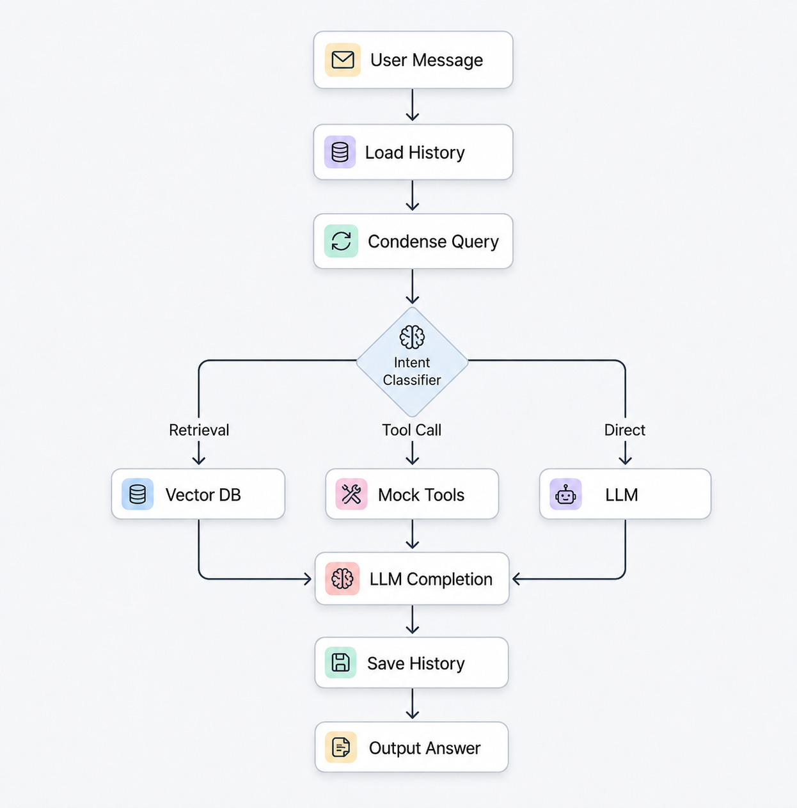

# Mini AI Assistant

A modular RAG-powered AI Assistant built with FastAPI, Pinecone, and OpenAI. It supports document ingestion, conversation history memory, custom intent routing, and mock tools for order status and product searches.

##  Features & Pipeline

1. **Knowledge Ingestion**: Upload PDF, TXT, or Markdown files. The service chunks text using `tiktoken`, generates OpenAI embeddings, and stores them in Pinecone.
2. **Intent Classification & Routing**: Every query is evaluated to determine if it requires:
   - `RETRIEVAL`: Fetches document chunks from Pinecone.
   - `TOOL_CALL`: Executes Order Status or Product Search tools.
   - `DIRECT`: Friendly chit-chat or direct memory recall.
3. **Context Memory**: Conversation context is remembered across messages (resolving names, pronouns, and topic shifts) by rephrasing user queries using recent history.
4. **Mock Tools**:
   - **Order Status**: Looks up mock status in `orders.json` by Order ID.
   - **Product Search**: Searches mock inventory in `products.json` by product name.

---

## System Architecture

### Pipeline Flow



---

## Setup & Running

### 1. Configure Environment
Create a `.env` file in `app/` (or copy/rename `app/.env`) containing:
```env
PINECONE_API_KEY=your_pinecone_key
PINECONE_INDEX_NAME=your_pinecone_index
OPENAI_API_KEY=your_openai_key
OPENAI_MODEL=gpt-4o
```

### 2. Run with Docker
Start the entire service inside Docker:
```bash
docker compose up --build
```
*API documentation is available at: `http://localhost:9000/docs`*

---

## API Endpoints

### Ingestion
*   **`POST /api/ingest/upload`**: Upload a `.pdf`, `.txt`, or `.md` file to the data directory.
*   **`POST /api/ingest/ingest`**: Run the pipeline to chunk, embed, and upload documents to Pinecone.

### Chat
*   **`POST /api/chat/`**: Chat endpoint.
    *   **Request Body**:
        ```json
        {
          "user_id": "01",
          "session_id": "01",
          "message": "Where is my order ORD004?"
        }
        ```
    *   **Response**: Returns the model's finalized response (using history, retrieval, or tool results).

---

## Technical Details

*   **Ingestion Pipeline**: Scans `.pdf`, `.txt`, and `.md` files in the data directory, loads raw text (using `pypdf` for PDFs), splits them into overlapping chunks using `tiktoken`, generates embeddings with OpenAI, and stores them in Pinecone.
*   **Retrieval Approach**: Query vector embeddings are computed via OpenAI and compared against the Pinecone index using cosine similarity to retrieve the top $K$ context chunks.
*   **Memory Implementation**: Conversational history is loaded and saved to local session JSON files. A contextual `rewrite.py` service uses OpenAI to rewrite the latest user message into a standalone query based on recent chat history (resolving pronouns/context).
*   **Tool-Calling Strategy**: Utilizes OpenAI native Function Calling schemas for product search and order lookup. The pipeline routes requests to `executor.py`, executing queries against local JSON files (`orders.json` and `products.json`).
*   **Prompt Design**: Leverages system prompts tailored to the classified intent:
    - *Retrieval*: Instructs the model to rely only on context and reply exactly: `"I couldn't find that information in the uploaded documents."` if the answer is missing.
    - *Tool Call / Direct*: Commands standard guidelines for helpfulness, tone, and conciseness.

